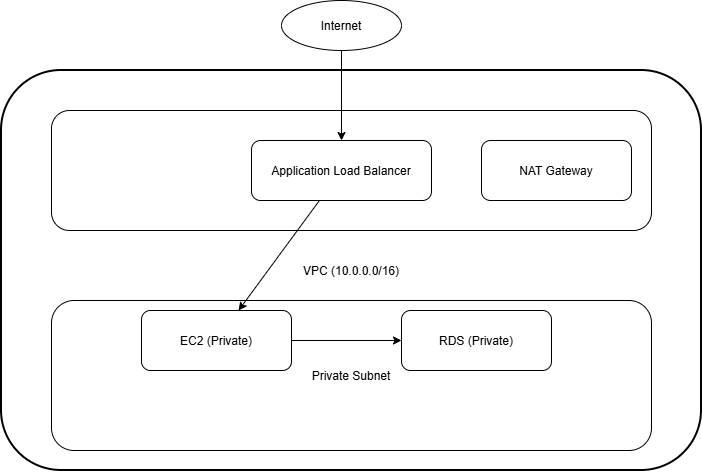
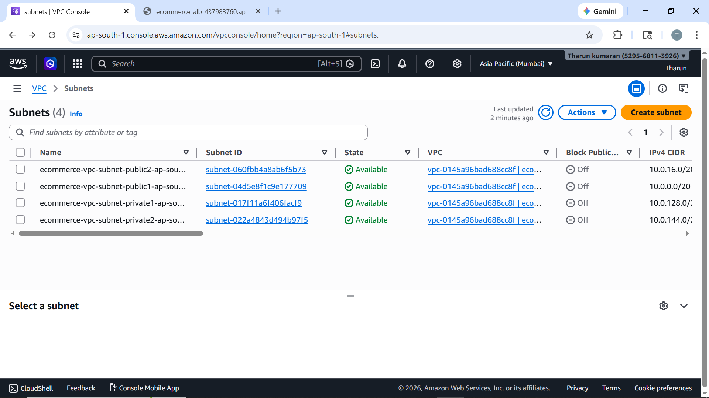
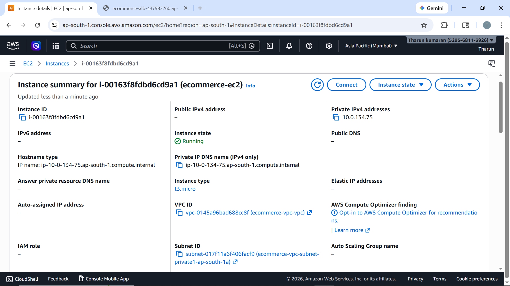
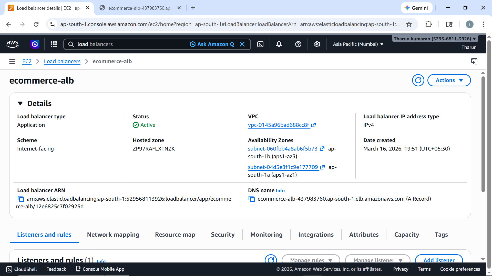
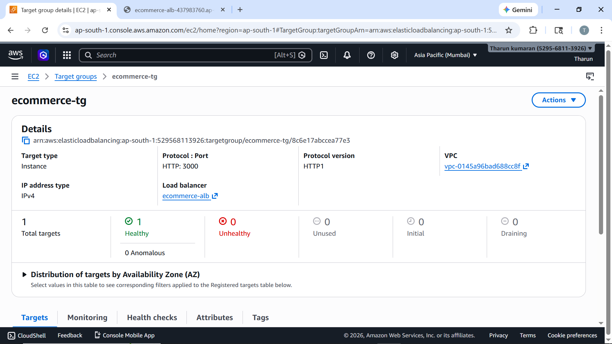
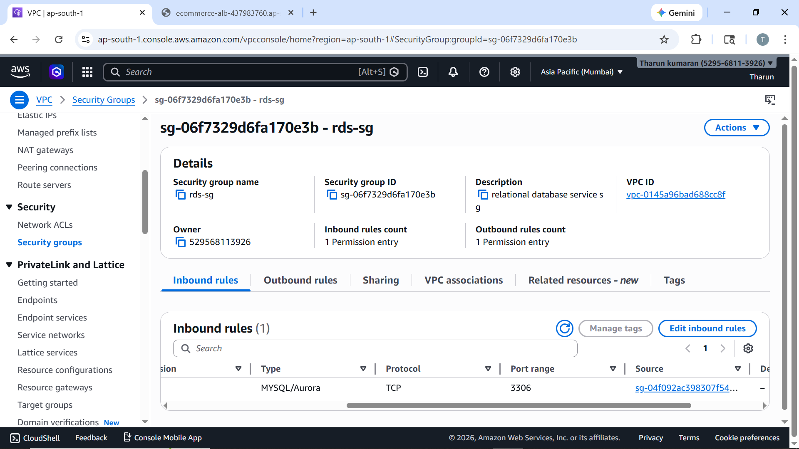

# Highly Available E-Commerce Architecture on AWS

## Project Description
This project demonstrates a highly available and fault-tolerant e-commerce architecture built using AWS services.

## Services Used
- VPC
- Subnets (Public & Private)
- Internet Gateway
- NAT Gateway
- EC2
- Application Load Balancer
- Target Group
- Auto Scaling (optional)
- RDS (MySQL)
- Security Groups

## Architecture

## Screenshots

### VPC

### Subnets

### Security Groups

### EC2

### Load Balancer

### Target Group

### RDS

### App Running

### RDS SG

## Result
Application is accessible through Load Balancer and database is secured in private subnet.